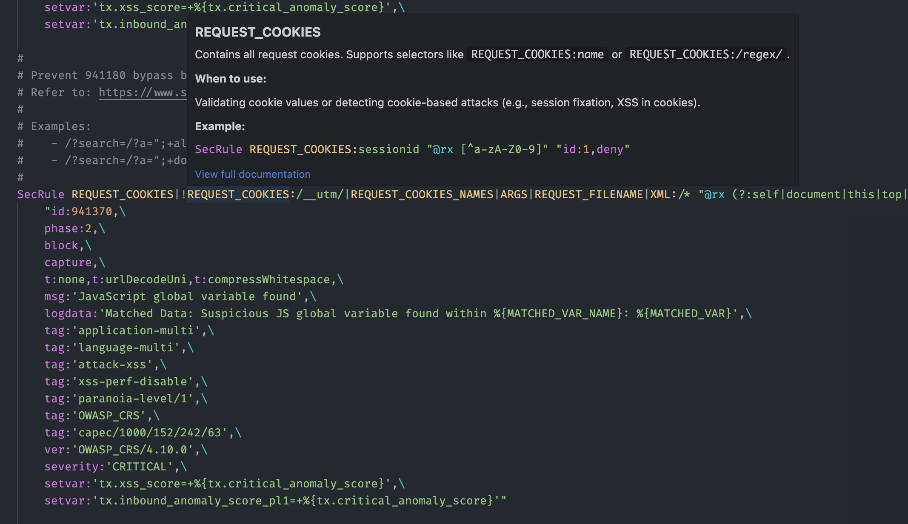

# SecRules Language Support for VSCode

A Visual Studio Code extension (available [here](https://marketplace.visualstudio.com/items?itemName=louis-lau.secrules-syntax)) that provides syntax highlighting and hover documentation for SecRules, the language used by [ModSecurity](https://modsecurity.org/) and [Coraza](https://coraza.io/).



## Download

[VSCode Marketplace](https://marketplace.visualstudio.com/items?itemName=louis-lau.secrules-syntax)  
[Open VSX Registry](https://open-vsx.org/extension/louis-lau/secrules-syntax)  
[Source Code](https://github.com/louis-lau/vscode-secrule-language-plugin)  


## Features

### Syntax Highlighting
- Full syntax highlighting for ModSecurity SecRules directives
- Color-coded variables, operators, actions, and transformations
- Support for `.secrules` and `.conf` file extensions

### Hover Documentation
Hover over any SecRules keyword to see detailed documentation including:
- **Directives**: `SecRule`, `SecAction`, `SecRuleUpdateTargetById`, etc.
- **Actions**: `id`, `phase`, `msg`, `deny`, `allow`, `block`, etc.
- **Operators**: `@rx`, `@pm`, `@beginsWith`, `@detectSQLi`, etc.
- **Variables**: `ARGS`, `REQUEST_URI`, `REMOTE_ADDR`, etc.
- **ctl Actions**: `ruleRemoveTargetById`, `ruleRemoveById`, etc.

Each hover tooltip includes:
- Description of the keyword
- Syntax information
- Usage examples
- Desctiption of when to use the keyword
- Related actions
- Documentation link to the official ModSecurity Reference Manual (v3.x)

## Documentation Source

The hover documentation was extracted from the official ModSecurity Reference Manual (v3.x) by GPT5, with some manual additions. If there are any mistakes, PRs are welcome!

### Unit tests

```bash
npm run test
```

Uses `vscode-tmgrammar-test` for unit tests. See docs: [vscode-tmgrammar-test](https://github.com/PanAeon/vscode-tmgrammar-test).

If you find and fix a syntax highlighting issue, please create a unit test for it before fixing it or creating a PR.
